# Viettel Post Data Warehouse - Architecture Diagrams

## 1. High-Level Architecture (Medallion Architecture)


---

## 2. Star Schema - Data Model

```mermaid
erDiagram
    DIM_CUSTOMERS ||--o{ FACT_SHIPMENTS : has
    DIM_ROUTES ||--o{ FACT_SHIPMENTS : has
    DIM_DATE_PICKUP ||--o{ FACT_SHIPMENTS : has
    DIM_DATE_DELIVERY ||--o{ FACT_SHIPMENTS : has
    DIM_SERVICE_TYPES ||--o{ FACT_SHIPMENTS : has
    
    DIM_CUSTOMERS {
        int customer_key PK
        string customer_id NK
        string customer_name
        string customer_type
        string customer_segment
        string province
        date registration_date
        int customer_tenure_days
        string lifecycle_stage
        bit is_active
    }
    
    DIM_ROUTES {
        int route_key PK
        string route_id NK
        string route_name
        string origin_province
        string destination_province
        decimal distance_km
        decimal estimated_duration_hours
        string transport_mode
        string distance_category
        bit is_express_route
    }
    
    DIM_DATE_PICKUP {
        int date_key PK
        date full_date
        int year
        int month
        int quarter
        string month_name
        string day_name
        bit is_weekend
    }
    
    DIM_DATE_DELIVERY {
        int date_key PK
        date full_date
        int year
        int month
        int quarter
        string month_name
        string day_name
        bit is_weekend
    }
    
    DIM_SERVICE_TYPES {
        int service_type_key PK
        string service_type_code
        string service_type_name
        string service_tier
    }
    
    FACT_SHIPMENTS {
        string shipment_id PK
        int customer_key FK
        int route_key FK
        int pickup_date_key FK
        int delivery_date_key FK
        int service_type_key FK
        decimal weight_kg
        decimal volume_cbm
        decimal shipping_fee
        decimal total_revenue
        decimal cod_amount
        decimal actual_delivery_hours
        decimal promised_delivery_hours
        decimal delivery_delay_hours
        decimal customer_rating
        bit is_on_time
        bit is_delivered
        bit is_damaged
        bit is_returned
        bit is_perfect_delivery
    }

## 3. Data Flow - ETL Process

```mermaid
flowchart TD
    Start([Start ETL Process]) --> LoadBronze[Load Bronze Layer]
    
    LoadBronze --> B1[Load bronze.viettel_customers<br/>TRUNCATE + BULK INSERT]
    B1 --> B2[Load bronze.viettel_locations<br/>TRUNCATE + BULK INSERT]
    B2 --> B3[Load bronze.viettel_routes<br/>TRUNCATE + BULK INSERT]
    B3 --> B4[Load bronze.viettel_shipments<br/>TRUNCATE + BULK INSERT]
    
    B4 --> BronzeComplete{Bronze<br/>Complete?}
    BronzeComplete -->|Yes| LoadSilver[Load Silver Layer]
    BronzeComplete -->|No| ErrorBronze[Log Error & Stop]
    
    LoadSilver --> S1[Transform & Load<br/>silver.viettel_customers]
    S1 --> S1T[✓ TRIM whitespace<br/>✓ Convert TRUE/FALSE to BIT<br/>✓ Standardize province to UPPER<br/>✓ Lowercase emails<br/>✓ Validate customer_type]
    
    S1T --> S2[Transform & Load<br/>silver.viettel_locations]
    S2 --> S2T[✓ TRIM whitespace<br/>✓ Convert TRUE/FALSE to BIT<br/>✓ Validate location_type<br/>✓ Convert numeric types]
    
    S2T --> S3[Transform & Load<br/>silver.viettel_routes]
    S3 --> S3T[✓ Standardize provinces to UPPER<br/>✓ Calculate avg_speed_kmh<br/>✓ Validate transport_mode<br/>✓ Convert numeric types]
    
    S3T --> S4[Transform & Load<br/>silver.viettel_shipments]
    S4 --> S4T[✓ Convert datetime types<br/>✓ Convert TRUE/FALSE to BIT<br/>✓ Validate service_type<br/>✓ Calculate derived columns]
    
    S4T --> SilverComplete{Silver<br/>Complete?}
    SilverComplete -->|Yes| GoldReady[Gold Layer Views Ready]
    SilverComplete -->|No| ErrorSilver[Log Error & Stop]
    
    GoldReady --> Summary[Generate Load Summary<br/>Show row counts and duration]
    Summary --> End([ETL Complete])
    
    ErrorBronze --> End
    ErrorSilver --> End

    style Start fill:#90EE90
    style LoadBronze fill:#cd7f32,color:#000
    style LoadSilver fill:#c0c0c0,color:#000
    style GoldReady fill:#ffd700,color:#000
    style End fill:#90EE90
    style ErrorBronze fill:#ff6b6b
    style ErrorSilver fill:#ff6b6b
```

---

## 4. Data Lineage - Shipments

```mermaid
flowchart LR
    subgraph Source
        CSV[viettel_shipments.csv<br/>100,000+ rows]
    end

    subgraph Bronze_Layer["Bronze Layer"]
        BTable[bronze.viettel_shipments<br/>▪ Raw data 1:1 copy<br/>▪ All columns as NVARCHAR]
    end

    subgraph Silver_Layer["Silver Layer"]
        STable[silver.viettel_shipments<br/>▪ Cleaned & typed data<br/>▪ Proper data types<br/>▪ Derived columns added]
        
        Transforms[Transformations:<br/>✓ Convert strings to BIT<br/>✓ Convert strings to DATETIME<br/>✓ Convert strings to DECIMAL<br/>✓ Calculate pickup_date<br/>✓ Calculate delivery_delay]
    end

    subgraph Gold_Layer["Gold Layer"]
        FactTable[fact_shipments VIEW<br/>▪ Joins to all dimensions<br/>▪ Surrogate keys added<br/>▪ Business calculations]
        
        DimCustomer[dim_customers]
        DimRoute[dim_routes]
        DimDate[dim_date]
        DimService[dim_service_types]
        
        Reports[Analytics Views:<br/>• daily_summary<br/>• customer_performance<br/>• route_performance]
    end

    CSV -->|BULK INSERT| BTable
    BTable -->|Transform & Load| STable
    Transforms -.->|Apply| STable
    
    STable -->|SELECT with JOINS| FactTable
    DimCustomer -->|customer_key| FactTable
    DimRoute -->|route_key| FactTable
    DimDate -->|date_key| FactTable
    DimService -->|service_type_key| FactTable
    
    FactTable -->|Aggregate| Reports

    style Bronze_Layer fill:#cd7f32,color:#000
    style Silver_Layer fill:#c0c0c0,color:#000
    style Gold_Layer fill:#ffd700,color:#000
```



---

## 5. Transformation Details - Silver Layer

```mermaid
flowchart TD
    subgraph Input["Bronze Layer Input"]
        B1["customer_type = 'Individual'<br/>is_active = 'True'<br/>province = 'hà nội'<br/>email = 'JOHN@EXAMPLE.COM'"]
    end

    subgraph Transforms["Silver Transformations"]
        T1[Data Cleansing<br/>• TRIM whitespace<br/>• Remove duplicates]
        T2[Data Standardization<br/>• UPPER for provinces<br/>• LOWER for emails<br/>• Validate enums]
        T3[Type Conversion<br/>• TRUE/FALSE → BIT<br/>• Strings → DECIMAL<br/>• Strings → DATE]
        T4[Data Enrichment<br/>• Calculate tenure_days<br/>• Derive lifecycle_stage<br/>• Add metadata]
    end

    subgraph Output["Silver Layer Output"]
        S1["customer_type = 'Individual'<br/>is_active = 1 bit<br/>province = 'HÀ NỘI'<br/>email = 'john@example.com'<br/>customer_tenure_days = 456<br/>dwh_create_date = GETDATE()"]
    end

    B1 --> T1
    T1 --> T2
    T2 --> T3
    T3 --> T4
    T4 --> S1

    style Input fill:#cd7f32,color:#000
    style Output fill:#c0c0c0,color:#000
    style Transforms fill:#87CEEB
```



---

## 6. Analytics Dashboard Flow


---

## 7. Execution Flow

```mermaid
sequenceDiagram
    participant User
    participant MasterProc as load_data_warehouse
    participant BronzeProc as bronze.load_bronze
    participant SilverProc as silver.load_silver
    participant GoldViews as Gold Layer Views
    participant Database as viettel_post_dwh

    User->>MasterProc: EXEC load_data_warehouse;
    activate MasterProc
    
    MasterProc->>BronzeProc: EXEC bronze.load_bronze;
    activate BronzeProc
    
    BronzeProc->>Database: TRUNCATE bronze tables
    BronzeProc->>Database: BULK INSERT from CSV files
    Database-->>BronzeProc: ✓ 110K+ rows loaded
    
    BronzeProc-->>MasterProc: ✓ Bronze Complete (5s)
    deactivate BronzeProc
    
    MasterProc->>SilverProc: EXEC silver.load_silver;
    activate SilverProc
    
    SilverProc->>Database: TRUNCATE silver tables
    SilverProc->>Database: INSERT with transformations
    Database-->>SilverProc: ✓ 110K+ rows transformed
    
    SilverProc-->>MasterProc: ✓ Silver Complete (10s)
    deactivate SilverProc
    
    MasterProc->>GoldViews: Verify views exist
    GoldViews-->>MasterProc: ✓ 5 dimensions + 1 fact + 5 reports
    
    MasterProc->>Database: Query row counts
    Database-->>MasterProc: Summary statistics
    
    MasterProc-->>User: ✓ Load Complete (15s total)<br/>Ready for analytics!
    deactivate MasterProc
```



---

*These diagrams can be rendered in any Markdown viewer that supports Mermaid syntax*
*For best viewing: GitHub, GitLab, VS Code with Mermaid extension, or mermaid.live*
